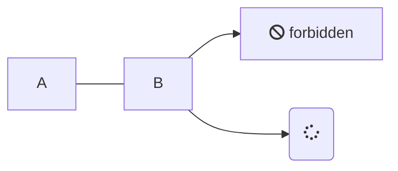

[TOC]

# docsify

## 插件

### `====` 高亮

https://blog.csdn.net/Hubz131/article/details/113062430

==高亮支持==

### mermaid 支持

https://github.com/Leward/mermaid-docsify



### 多标签页

https://jhildenbiddle.github.io/docsify-tabs/#/

```log
必须大写才能表示一个标签页
#### **Italian**
```

<!-- tabs:start -->

#### **English**

Hello!

#### **French**

Bonjour!

#### **Italian**

Ciao!

<!-- tabs:end -->

### 高亮

https://github.com/fzankl/docsify-plugin-flexible-alerts

> [!TIP]
> An alert of type 'tip' using global style 'callout'.
